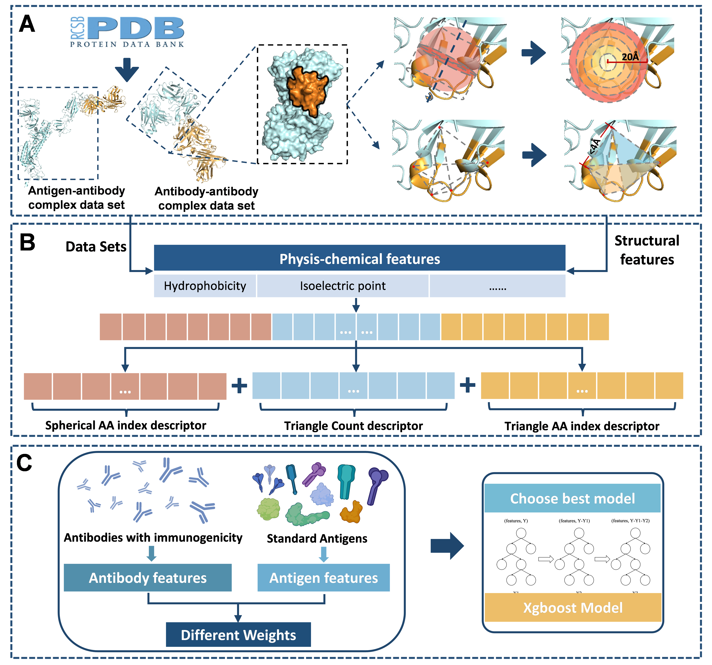

# ReadMe #

Code repository for ourpaper "SITA: 
Predicting **S**ite-specific **I**mmunogenicity for **T**herapeutic **A**ntibodies"



SITA takes pdb format files as input and predicts the immunogenicity（SITA score） of each aa residue in the antibody structure.

```
├─bin
│  ├─feature_extractor
│  │  ├─Information
│  └─model
│      ├─model_files
├─example
   └─PDB_data
```


## Environment setup ##


1. Change directory to the path of this project
```bash
cd {your_path_to_SITA}
```
2. Run following codes in your terminal
```bash
conda create -n SITA python=3.7
conda deactivate # (if base environment is activated)
conda activate SITA
pip install -r requirements.txt
```
Mind that `freesasa` might have dependencies on C++ compiler, following the instructions provided by itself'll fix the problem.


## USAGE ##
A command line tool is provided to use SITA for immunogenicity prediction. Usage is as follows:

### data preparation ###
SITA accepts following parameters
```bash
usage: SITA.py [-h] -p PDB -c CHAIN -o OUT [-v]

optional arguments:
  -h, --help            show this help message and exit
  -p PDB, --pdb PDB     path to your PDB file folder
  -c CHAIN, --chain CHAIN
                        path to your chain file
  -o OUT, --out OUT     path to the folder you hope to save the output
  -v, --verbose         provides more detailed output if set true
```
Thus following file/folders should be prepared:
1. pdb file folder: a folder containing all your pdb files. Please check `./example/PDB_data` for an example of pdb file folder. Note that structures with only C-alpha are **not** supported.
2. chain file: a file mentioning the interested chains in the pdb file folder. Data should be orgnized in format {PDB_FILE_NAME},{CHAIN1},{CHAIN2} each line. You might check `./example/PDB_idChain.txt` for an example.


### running CLI tool ###

With aforementioned  files prepared, run following commands to make predictions with SITA:
```bash
cd bin
python SITA.py -p {your_pdb_folder} -c {your_chain_file} -o {your_output_folder} -v
```


